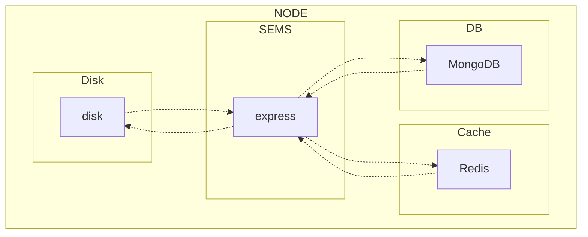

# SEMS(simple express media server)

## Structure Diagram

## Features

1. 미디어 파일 업로드
2. 미디어 파일 다운로드
3. 미디어 파일 메타데이터 다운로드
4. 미디어 파일 섬네일 생성 및 캐싱
5. 미디어 파일 검색
6. 미디어 파일 삭제

##

## API

|                    Method                     | Path           |
| :-------------------------------------------: | :------------- |
|  **GET**   | /find/{id}     |
|  **GET**   | /download/{id} |
|  **GET**   | /metadata/{id} |
|  **GET**   | /thumb/{id}    |
|  **POST**  | /upload        |
| **DELETE** | /remove/{id}   |
